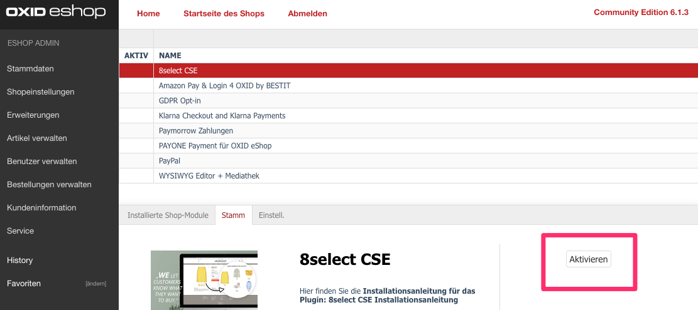
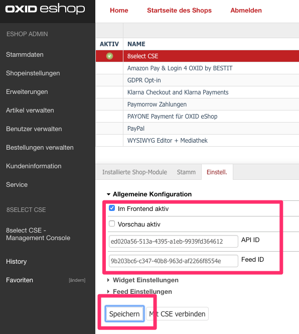
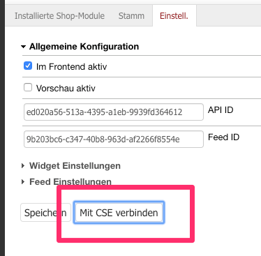

## Systemvoraussetzungen

### Kompatibel mit folgenden OXID eShop Versionen

- CE/PE/EE 6.x

### Anforderungen an Webserver / MySQL / PHP / PHP Erweiterungen

Es gelten die [Systemvoraussetzungen für Oxid 6](https://docs.oxid-esales.com/developer/en/6.1/getting_started/installation/server_and_system_requirements.html).

## Installation

1. Modul aus [OXID eXchange](https://exchange.oxid-esales.com/index.php?cl=search&searchparam=8SELECT) laden.
2. Modul entpacken.
3. Auf Ihrem Webserver im Shopverzeichnis (Root-Pfad des Oxid Shops) den Unterordner `source/modules/asign/8select` anlegen.
4. Das entpackte Modul (alles _innerhalb_ des Ordners `CseEightselectBasic`) in diesen neu erstellten Ordner kopieren/hochladen.
5. Im Shopverzeichnis in der Datei `composer.json` den Autoload-Pfad für das Modul hinzufügen - die Datei muss unter `autoload` / `psr-4` folgenden Eintrag enthalten:
```
  "autoload": {
    "psr-4": {
      "ASign\\EightSelect\\": "./source/modules/asign/8select"
    }
  }
```
6. Composer Autoloader updaten mit dem Befehl 
```
composer dumpautoload
```
7. _Ab OXID 6.2_: Neu installiertes Modul registrieren mit dem Befehl 
```
vendor/bin/oe-console oe:module:install-configuration source/modules/asign/8select
```

## Modul aktivieren und konfigurieren

- Im OXID eShop Admin-Bereich in der Modul-Verwaltung das 8SELECT-Modul auswählen und "Aktivieren".



- Unter dem Reiter "Einstell." im Abschnitt "Allgemeine Konfiguration" die API-ID und Feed-ID eingeben.
- Ausspielung der 8SELECT-Widgets aktivieren:
  - entweder im Vorschau-Modus (für einen Testbetrieb - dann werden die Widgets nur ausgespielt wenn an die URL ein Parameter `8s_preview=1` angehängt wird, z.B. `https://www.my-shop.com/page?8s_preview=1`): dazu das Häkchen bei "Vorschau aktiv" setzen.
  - oder immer, d.h. für den Produktivbetrieb: dazu das Häkchen "Im Frontend aktiv" setzen.
- Nach diesen Einstellungen "Speichern".



- Ihren Oxid Shop im 8SELECT-System registrieren: dazu den Button "Mit CSE verbinden" klicken.



- Im Anschluss in der [8SELECT Management Console](https://console.8select.io) einloggen und die Konfiguration Ihrer Produktdaten vornehmen - dies funktioniert exakt [wie für unser Shopware Plugin](https://knowledge.8select.com/knowledge/konfiguration-shopware-plugin).


## Deinstallation

1. Das Modul im OXID eSHOP Admin-Bereich in der Modul-Verwaltung deaktivieren
2. Das Verzechnis "modules/asign/8select" löschen
3. Folgende Datenbank-Tabellen löschen:

   - eightselect_attribute2oxid
   - eightselect_attributes
   - eightselect_log

## Changelog

Siehe [CHANGELOG](https://github.com/8select/oxid6-plugin-sob/blob/master/CHANGELOG.md).
